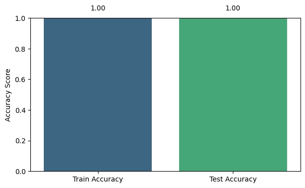
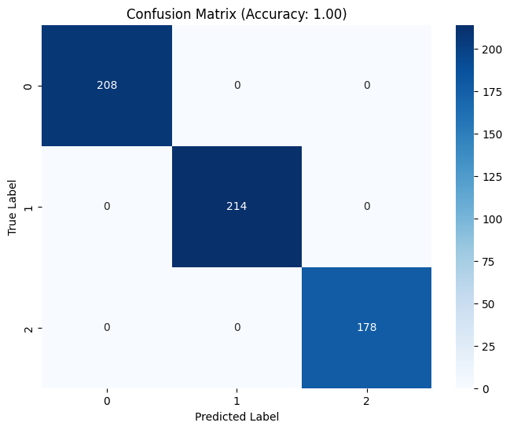

# Sentiment_Predict

A model for detecting the type of speech (sentiment) in text, with three classes: **Negative**, **Neutral**, and **Positive**.

---

## 📌 Introduction

**Sentiment_Predict** is a supervised deep learning model implemented using a Sequential neural network in Keras, designed to analyze and classify the type of speech (sentiment) present in a text.

---

## ⚙️ Technologies Used

| Tool | Purpose |
|---|---|
| Python | Main development language |
| TensorFlow / Keras | Building and training the model |
| Pandas | Data processing and management |
| NumPy | Numerical and array operations |
| Matplotlib | Plotting charts |
| Seaborn | Visualizing data and the confusion matrix |

---

## 🧠 Model Specifications

- **Learning Type:** Supervised
- **Model Architecture:** `keras.Sequential`
- **Evaluation Metrics:**
  - Accuracy (Train)
  - Accuracy (Test)
  - Confusion Matrix

---

## 📊 Model Results

| Dataset | Accuracy |
|---|---|
| Train | 1.0 |
| Test | 1.0 |

> Confusion Matrix image generated in the Jupyter Notebook:



### Confusion Matrix

> Confusion Matrix image generated in the Jupyter Notebook:



## 📥 Input and Output

**Input:** A text string (the text to be analyzed for sentiment)

**Output:** An integer representing the sentiment type:

| Output Number | Label |
|---|---|
| 0 | Negative |
| 1 | Neutral |
| 2 | Positive |

---

## 🚀 Installation

```bash
git clone https://github.com/username/Sentiment_Predict.git
cd Sentiment_Predict
pip install -r requirements.txt
```

---

## ▶️ Usage

```python
from sentiment_predict import predict

text = "your input text"
result_text = v.transform(text) 
result = predict(result_text)

print(result)  # Output: 0, 1, or 2
```

---

## ✨ Features

- High accuracy in detecting speech type
- Simple and lightweight implementation with Keras Sequential
- Directly usable on Persian/English texts

---

## 📄 License

This project is released under the **MIT** license.
